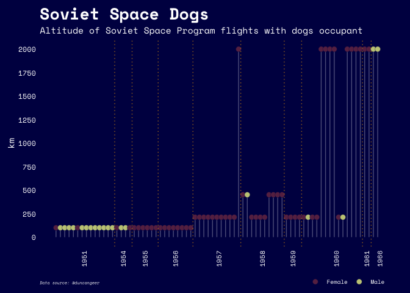
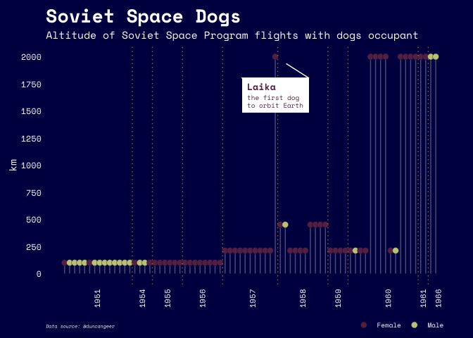

Soviet dogs in space
================
Davide Fucci
2020-05-25

The
[data](https://airtable.com/universe/expG3z2CFykG1dZsp/sovet-space-dogs)
is provided by [Duncan Geere](www.twitter.com/duncangeer). It is a
database of dogs that flew on space missions based on the book *Soviet
Space Dogs.*

Loading basic things. Beside tidyverse, lubridate helps to work with
dates, janitor helps linting dataframes, whereas ggforce and ggtext put
ggplot on steroids.

``` r
dogs <- read_csv("data/Dogs-Database.csv")
flights <- read_csv("data/Flights-Database.csv")
```

The Dogs dataframe is the most important, contains name of the dogs,
gender, and they flight they were on. The flight table contains
additional information on the flight (most importantly, altitute).

``` r
dogs_tidy <- dogs %>% 
  clean_names() %>% 
  separate_rows(flights, sep = ",") %>% 
  mutate(date_flight = ymd(flights),
         date_death = case_when(str_sub(fate, 1, 4) == "Died" ~ str_sub(fate, 6, 15)),
         date_death = ymd(date_death),
         flight_fate = case_when(date_flight == date_death ~ "Died",
                          TRUE ~ "Survived")) %>% 
  select(-notes, -fate, -flights)
```

Tidy up the dogs dataframe, linting the column names to use camel case
(`clean_names()`), separate multiple flights in the same cell over
several columns, and parse dates. Finally, remove unimportant columns.

``` r
flights_tidy <- flights %>% 
  clean_names() %>% 
  select(date_flight = date, rocket, altitude_km, result, notes_flight = notes) %>% 
  filter(altitude_km != "unknown") %>% 
  mutate(altitude = case_when(str_detect(altitude_km, "^[0-9]") ~ parse_number(altitude_km), 
                              str_detect(altitude_km, "orbital") ~ 2000))  # 2000 km is the terrestrial orbit altitude according to Wikipedia
```

Same for cleaning for flights. Important thing to do here is to parse
altitude, as sometimes contains an integer value (in km), other times
the string *orbital*, and other times *unknown* (which are filtered
out).

``` r
all_dogs_flights <- dogs_tidy %>% 
  inner_join(flights_tidy, by = "date_flight") %>% 
  mutate(flight_year = year(date_flight)) %>% 
  arrange(date_flight) 
  
all_dogs_flights <- all_dogs_flights %>% 
  mutate(rank = 1:nrow(all_dogs_flights)) # adds incremental rank based on year
```

Join the two tables, extract only the year of the flight in a separate
column which is used as a label for the x-axis in the plot. Order the
flights by year and add an incremental id (`rank`) to use as x-axis
value in the plot.

H\\T to David Smale for how to clean this dataset. Check his other
[awesome
visualization](https://davidsmale.netlify.app/portfolio/soviet-space-dogs-part-2/)
of Soviet Dogs in Space.

``` r
labels = rep("",75) 
to_keep<-c(7,16,21,28,38,48,55,65,72,75) # middle-point within each year range
labels[to_keep] = all_dogs_flights$flight_year[to_keep] 
year_change = c(14.5, 18.5, 24.5, 32.5, 43.5, 53.5, 57.5, 71.5, 73.5) # x-axis value indicating when there is a change in year. For example, there are 14 flights in the first year of data, 4 for the second (14+4=18) and so on.
```

A bit hackish, but needed to keep only few of the label to avoid to
repetitively print the year on the x-axis for each datapoint.
`year_change` are the y=0 intercepts to be plotted.

``` r
p <- ggplot(all_dogs_flights, aes(x=rank, y=altitude)) +
  geom_segment(aes(x=rank, y=0, xend=rank, yend=altitude), color="white", alpha = 0.3) +
  geom_point(aes(fill=gender), shape = 21, colour = "#000050", size = 3, stroke = 0.2) + 
  scale_y_continuous(breaks = seq(0, 2250, 250)) +
  scale_fill_manual(values = c("Male" = "#c5ca85", "Female" = "#682d51")) +
  geom_vline(xintercept = year_change, color="#E69F00", alpha =0.7, linetype="dotted") +
  labs(y = "km", x = "", 
       title = "Soviet Space Dogs",
       subtitle = "Altitude of Soviet Space Program flights with dogs occupant",
       caption = "Data source: @duncangeer") + 
  scale_x_continuous(labels = labels, breaks=seq(1,75,1)) +
  theme(plot.background = element_rect(fill = "#000050", colour = "#000050"),
        panel.background = element_rect(fill = "#000050", colour = "#000050"),
        panel.grid.minor = element_blank(),
        panel.grid.major = element_blank(),
        text = element_text(colour = "white", family = "Space Mono"),
        plot.caption = element_text(color = "white", face = "italic", size = 5, hjust = 0),
        axis.text = element_text(colour = "white"),
        axis.text.x = element_text(size=8, colour ="white", angle = 90 ),
        axis.ticks.x = element_blank(),
        axis.ticks.y = element_blank(),
        plot.title = element_text(face = "bold", size = 20),
        plot.margin = margin(10,20,10,10),
        legend.background = element_rect(fill =  alpha("white", 0.0), colour =  alpha("white", 0.0)),
        legend.key = element_rect(fill = "#000050", colour = "#000050" ),
        legend.direction = "horizontal",
        legend.text = element_text(size=7),
        legend.title = element_blank(),
        legend.position = c(0.86, -0.17))
p
```

<!-- -->

[Lollipop
plot](https://www.r-graph-gallery.com/300-basic-lollipop-plot.html). The
taller the stem, the higher the dog flew into space.

``` r
p_annotated <- p + geom_mark_circle(aes(filter = name_latin == 'Laika', label = 'Laika',description = "the first dog\nto orbit Earth"),
                   label.family = "Space Mono",
                   label.fontsize = c(10, 7),
                   label.colour = c("#682d51", "#682d51"),
                   label.fill = "white",
                   label.buffer = unit(1, "mm"),
                   con.colour = "white",
                   colour = NA,
                   con.type = "straight",
                   con.cap = 0)
p_annotated
```

<!-- -->

Annotating the plot with `ggtext`. See
[Laika](https://en.wikipedia.org/wiki/Laika) Wikipedia entry.
